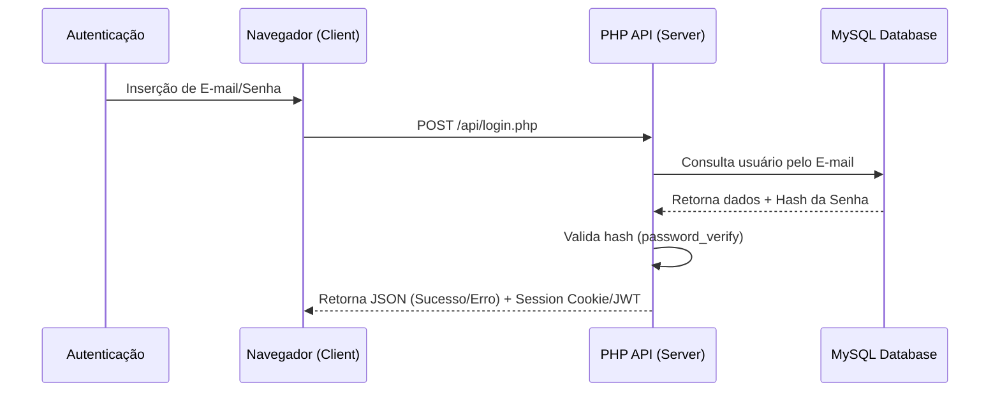

# Planejamento para Autenticação Dinâmica e Gestão de Credenciais

Este documento detalha a arquitetura proposta para a segunda fase do projeto, onde o login estático do painel da **MulinoTech** será substituído por uma validação dinâmica baseada em banco de dados MySQL, com controle total de credenciais pela equipe administrativa.

---

## 1. Arquitetura de Segurança

Para garantir que apenas clientes autorizados acessem os ecossistemas, o fluxo de autoinscrição (Self-Register) permanecerá desativado. O provisionamento de contas será estritamente administrativo.



---

## 2. Estrutura do Banco de Dados (MySQL)

Uma nova tabela chamada `usuarios` deverá ser criada no banco de dados existente (`mulino_wl_db`). 

### Comando SQL de Criação
```sql
CREATE TABLE IF NOT EXISTS usuarios (
    id INT AUTO_INCREMENT PRIMARY KEY,
    nome VARCHAR(100) NOT NULL,
    email VARCHAR(100) UNIQUE NOT NULL,
    senha_hash VARCHAR(255) NOT NULL,
    nivel_acesso ENUM('cliente', 'administrador') DEFAULT 'cliente',
    ativo TINYINT(1) DEFAULT 1,
    ultimo_login DATETIME DEFAULT NULL,
    criado_em TIMESTAMP DEFAULT CURRENT_TIMESTAMP
) ENGINE=InnoDB DEFAULT CHARSET=utf8mb4;
```

> [!IMPORTANT]
> A coluna `senha_hash` armazena a senha do usuário criptografada usando algoritmos de hashing forte de via única (como BCRYPT). **Nunca** armazene senhas em texto puro.

---

## 3. Criação de Credenciais Administrativas

Como a criação de usuários é interna, a equipe da MulinoTech poderá cadastrar novos clientes das seguintes formas:

### Opção A: Script CLI Seguro (Recomendado)
Um pequeno script em PHP rodando localmente/servidor para criar novos usuários e gerar o hash de senha correto.
```php
// Exemplo de geração de senha criptografada via PHP:
$senha_pura = 'senhaCliente123';
$senha_hash = password_hash($senha_pura, PASSWORD_BCRYPT);
// Insira $senha_hash diretamente no banco de dados.
```

### Opção B: Painel Administrativo Interno
Futura criação de uma rota administrativa secreta (ex: `/admin/usuarios`) com acesso exclusivo para administradores da MulinoTech criarem, editarem e desativarem contas de clientes.

---

## 4. API de Autenticação (`/api/login.php`)

Este endpoint receberá as credenciais do formulário, validará contra o banco de dados e gerenciará as sessões.

### Protótipo da API (`api/login.php`)
```php
<?php
header('Content-Type: application/json');
require_once '../config/db.php'; // Usa a conexão PDO existente

if ($_SERVER['REQUEST_METHOD'] !== 'POST') {
    http_response_code(405);
    echo json_encode(['erro' => 'Método não permitido']);
    exit;
}

$input = json_decode(file_get_contents('php://input'), true);
$email = filter_var($input['email'] ?? '', FILTER_VALIDATE_EMAIL);
$senha = $input['senha'] ?? '';

if (!$email || !$senha) {
    http_response_code(400);
    echo json_encode(['erro' => 'E-mail e senha são obrigatórios']);
    exit;
}

try {
    // 1. Buscar usuário
    $stmt = $pdo->prepare("SELECT id, nome, email, senha_hash, ativo FROM usuarios WHERE email = ? LIMIT 1");
    $stmt->execute([$email]);
    $usuario = $stmt->fetch();

    // 2. Verificar usuário e senha
    if ($usuario && $usuario['ativo'] && password_verify($senha, $usuario['senha_hash'])) {
        // Iniciar sessão PHP segura
        session_start();
        $_SESSION['usuario_id'] = $usuario['id'];
        $_SESSION['usuario_nome'] = $usuario['nome'];
        $_SESSION['usuario_email'] = $usuario['email'];
        
        // Atualizar data do último login
        $stmtUpdate = $pdo->prepare("UPDATE usuarios SET ultimo_login = NOW() WHERE id = ?");
        $stmtUpdate->execute([$usuario['id']]);

        echo json_encode([
            'sucesso' => true,
            'mensagem' => 'Autenticação realizada com sucesso',
            'nome' => $usuario['nome']
        ]);
    } else {
        http_response_code(401);
        echo json_encode(['erro' => 'Credenciais inválidas ou conta inativa']);
    }
} catch (Exception $e) {
    http_response_code(500);
    echo json_encode(['erro' => 'Erro interno de servidor']);
}
```

---

## 5. Ajustes no Frontend (`login.html` & `dashboard.html`)

### No `login.html`:
Substituir o processamento local no listener do formulário por uma requisição `fetch` apontando para o endpoint PHP:
```javascript
form.addEventListener('submit', (e) => {
    e.preventDefault();
    
    // Inicia feedback visual de carregamento...
    
    fetch('api/login.php', {
        method: 'POST',
        headers: { 'Content-Type': 'application/json' },
        body: JSON.stringify({
            email: emailInput.value.trim(),
            senha: passwordInput.value
        })
    })
    .then(response => response.json())
    .then(data => {
        if (data.sucesso) {
            // Sucesso
            sessionStorage.setItem('logged_in', 'true');
            sessionStorage.setItem('user_email', emailInput.value.trim());
            window.location.href = 'dashboard.html';
        } else {
            // Tratar erro retornado da API
            exibirAlertaErro(data.erro);
        }
    })
    .catch(err => {
        exibirAlertaErro('Erro na rede. Tente novamente.');
    });
});
```

### No `dashboard.html`:
Adicionar validação de sessão em PHP no início do arquivo para que a proteção seja feita no lado do servidor (Back-end), evitando que a página renderize caso o usuário não esteja logado:
```php
<?php
session_start();
if (!isset($_SESSION['usuario_id'])) {
    header('Location: login.html');
    exit;
}
?>
```
